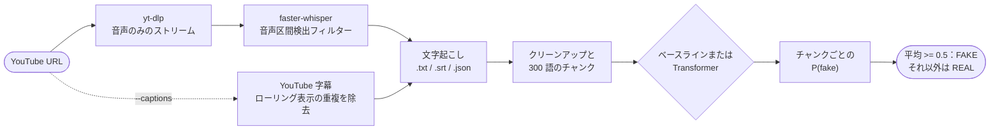

<div align="center">

🇺🇸 [English](README.md) | 🇨🇳 [简体中文](README.zh-CN.md) | 🇭🇰 [繁體中文](README.zh-HK.md) | 🇯🇵 **日本語** | 🇰🇷 [한국어](README.ko.md)

# yt-fakenews-classifier

**YouTube 動画を文字起こしし、その文字起こしが REAL と FAKE のどちらのニュースにどの程度似ているかをスコア化します。再現可能な TF-IDF ベースラインと、オプションの多言語 Transformer を備えています。**

[](https://github.com/jumincho/yt-fakenews-classifier/actions/workflows/ci.yml)
[](LICENSE)
[](pyproject.toml)
[](https://colab.research.google.com/github/jumincho/yt-fakenews-classifier/blob/main/notebooks/colab_quickstart.ipynb)

</div>

## 概要

`ytfakenews` は、次の処理を行うコマンドラインツール兼 Python パッケージです。

1. [yt-dlp](https://github.com/yt-dlp/yt-dlp) で動画の音声をダウンロードして [faster-whisper](https://github.com/SYSTRAN/faster-whisper) でローカルに文字起こしするか、動画自体の字幕を使います。
2. 文字起こしをクリーンアップし、互いに重なり合う 300 語のチャンクに分割します。
3. REAL または FAKE のラベルが付いたニュース記事で学習した分類器を使って各チャンクをスコア化し、P(fake) の平均を判定として、チャンクごとのスコアとあわせて報告します。

2 つの分類器が同じインターフェースを共有しています。CPU なら約 20 秒で学習できる TF-IDF + ロジスティック回帰の**ベースライン**（テストでの正解率 0.957、F1 0.958）と、GPU を使えるユーザー向けの、ファインチューニングした **XLM-RoBERTa** エンコーダーです。

> [!IMPORTANT]
> この分類器が学習したのは、2016 年頃の FAKE と REAL の*記事*がどのように見えるか、つまりその文体、語彙、そして収集元のウェブサイトの痕跡です。事実確認は行いません。話し言葉の文字起こしに対する判定は文体上のシグナルであり、真偽の判断ではありません。結果を使う前に[モデルカード](#モデルカードと制限事項)を読んでください。

## 仕組み



- **ダウンロード**：yt-dlp の Python API で最良の音声のみのストリームを取得します。再エンコードは一切しないため、ffmpeg は不要です。URL の代わりにローカルの音声ファイルや動画ファイルも使えます。
- **音声認識**：faster-whisper は CTranslate2 上で Whisper（デフォルトは `small` モデル）を Silero の音声区間検出フィルターとともに実行し、音声のデコードには PyAV を使うため、ffmpeg も PyTorch も必要ありません。`--translate` を指定すると、Whisper は直接英語で文字起こしします。
- **字幕**（`--captions`）：YouTube の自動字幕よりも、アップロード者が用意した字幕を優先します。自動字幕のローリング表示による繰り返しは取り除かれ、YouTube が機械翻訳したトラックには文字起こしの JSON でフラグが付けられます。
- **クリーンアップとチャンク分割**：タイムスタンプ、マークアップ、`[Music]` のような注釈、`>>` の話者マーカーを取り除きます。そのうえで、隣り合うウィンドウが少なくとも 50 語重なるようにしながら、できるだけ少ない数の 300 語ウィンドウでテキスト全体を覆います。ウィンドウは等間隔に並ぶため、末尾に短いチャンクが残ることはありません。
- **分類**：各チャンクに P(fake) が付きます。文字起こし全体の P(fake) はその平均で、平均が 0.5 以上（`--threshold`）ならラベルは FAKE です。平均は動画のどの部分も同じ重みで扱います。判定がどこから来ているかは、チャンクごとのスコアでわかります。

## クイックスタート

```bash
git clone https://github.com/jumincho/yt-fakenews-classifier.git
cd yt-fakenews-classifier
python -m venv .venv && source .venv/bin/activate
pip install -e ".[asr]"

ytfakenews train baseline      # CPU で約 20 秒。models/baseline/ に書き出します
ytfakenews run "https://www.youtube.com/watch?v=VIDEO_ID"
```

`run` は文字起こしを `outputs/<video id>.txt`、`.srt`、`.json` として保存し、判定をチャンクごとのスコアとともに表示します。最初の文字起こしでは Hugging Face Hub から Whisper モデルをダウンロードします。Whisper を使わずに済ませるには `--captions`、話されている言語を自動検出せずに指定するには `--language ko`、より良い文字起こしを得るには `--whisper-model large-v3` を使ってください。[Colab クイックスタート](notebooks/colab_quickstart.ipynb)では、同じ手順をブラウザーで実行できます。

[`examples/`](examples/) にある 2 つの架空の文字起こしを 1 つのテキストとして読み込み、上で学習したベースラインでスコア化すると、出力は次のようになります。

```console
$ cat examples/transcript_local_news.txt examples/transcript_sensational.txt \
    | ytfakenews predict - --chunk-words 150 --overlap 30
FAKE  P(fake) = 0.699  (threshold 0.50, mean over 4 chunks)
model: models/baseline (baseline); input: 503 words

chunk  words        P(fake)  preview
    1  0-150          0.539  Good evening, and thanks for joining us. I'm at City Hall, where ...
    2  117-267        0.368  the public library and keeps property tax rates unchanged. City staff presented ...
    3  235-385        0.923  weekend, the farmers market returns on Saturday morning at the fairgrounds, and ...
    4  353-503        0.967  leave the house. And who gets that data? Nobody will answer that ...
```

個別にスコア化すると、[地域ニュースの文字起こし](examples/transcript_local_news.txt)は REAL（P(fake) = 0.356）、[扇情的なほう](examples/transcript_sensational.txt)は FAKE（0.977）と判定されます。どちらもこのリポジトリのために書いたもので、現実のことは何も描写していません。

### インストールオプション

| インストール | 有効になる機能 | 主な依存関係 |
| --- | --- | --- |
| `pip install -e .` | `train baseline`、`evaluate`、`predict` | numpy、pandas、scikit-learn、joblib |
| `pip install -e ".[asr]"` | `transcribe`、`run` | yt-dlp（yt-dlp-ejs と Deno を含む）、faster-whisper |
| `pip install -e ".[transformer]"` | Transformer バックエンド | PyTorch、transformers、accelerate |
| `pip install -e ".[dev]"` | テストとリンター | pytest、ruff、mypy |

このパッケージは PyPI では公開していません。リポジトリをクローンせずに使う場合は、GitHub からインストールします。たとえば `pip install "ytfakenews[asr] @ git+https://github.com/jumincho/yt-fakenews-classifier"` とします。この場合、データセットはリポジトリの中にあるため、学習には `--data PATH` が必要です。足りない extra（オプションの依存関係）を必要とするコマンドは、どれをインストールすればよいかを表示します。最近の yt-dlp で YouTube を完全にサポートするには JavaScript ランタイムが必要で、`asr` extra は yt-dlp 自身の extra を通じてこのランタイム（Deno）をインストールします。YouTube からのダウンロードが失敗し始めたら、まず yt-dlp を更新してください。

### Python API

```python
from ytfakenews import classify_text, load_classifier
from ytfakenews.text import read_transcript

classifier = load_classifier("models/baseline")
prediction = classify_text(read_transcript("examples/transcript_sensational.txt"), classifier)
print(prediction.label, round(prediction.p_fake, 3))  # FAKE 0.977
for chunk in prediction.chunks:
    print(chunk.start_word, chunk.end_word, round(chunk.p_fake, 3))
```

## 学習と評価

### データ

[`data/fake_or_real_news.zip`](data/fake_or_real_news.zip) は公開データセット fake_or_real_news（Kaggle で配布）です。主に 2016 年の選挙前後の米国政治を扱った英語のニュース記事で、それぞれに REAL または FAKE のラベルが付いています。データは ZIP から直接読み込みます。文字起こしには見出しがないため、モデルが見るのは記事の本文だけで、見出しは使いません。

| クリーニング手順 | 記事数 |
| --- | ---: |
| CSV の行数 | 6,335（REAL 3,171、FAKE 3,164） |
| 本文が空のため除外 | 36（すべて FAKE） |
| 同じ本文に両方のラベルがあるため除外 | 0 |
| 本文が重複、後に出てくるコピーを除外 | 241（うち 29 件はタイトル、本文、ラベルがすべて同一） |
| **残った記事** | **6,058（REAL 2,989、FAKE 3,069）** |
| 層化分割、シード 42 | 学習 4,846、検証 606、テスト 606 |

重複する本文を取り除くことが重要なのは、一部の本文が複数の異なるタイトルで登場するためです。分割の両側にコピーがあると、テストのスコアが水増しされてしまいます。

### ベースラインの結果

単語のユニグラムとバイグラムに対する TF-IDF（サブリニア tf、`min_df` 3、`max_df` 0.9、特徴量 209,137 個）をロジスティック回帰（liblinear、C = 32）に入力します。適合率、再現率、F1 は FAKE を陽性クラスとして計算しています。表の各行は、リポジトリのルートで実行した次のコマンドによるものです。

```bash
ytfakenews train baseline               # デフォルトのシードは 42。検証とテストの行
ytfakenews evaluate --chunked           # 文字起こしと同じ経路：クリーンアップ、300 語のチャンク、平均
ytfakenews evaluate --max-words 100     # 各記事の最初の 100 語だけ（50、200、300 も）
```

| 分割と入力 | n | 正解率 | 適合率 | 再現率 | F1 | ROC-AUC |
| --- | ---: | ---: | ---: | ---: | ---: | ---: |
| 検証、記事全文 | 606 | 0.9505 | 0.9453 | 0.9577 | 0.9515 | 0.9900 |
| **テスト、記事全文** | 606 | **0.9571** | **0.9547** | **0.9609** | **0.9578** | **0.9895** |
| テスト、300 語チャンクの平均 | 606 | 0.9389 | 0.9116 | 0.9739 | 0.9417 | 0.9853 |
| テスト、最初の 300 語 | 606 | 0.9323 | 0.8982 | 0.9772 | 0.9360 | 0.9830 |
| テスト、最初の 200 語 | 606 | 0.9125 | 0.8671 | 0.9772 | 0.9188 | 0.9817 |
| テスト、最初の 100 語 | 606 | 0.8498 | 0.7784 | 0.9837 | 0.8691 | 0.9759 |
| テスト、最初の 50 語 | 606 | 0.7970 | 0.7170 | 0.9902 | 0.8317 | 0.9664 |

テスト記事の全文では、REAL 記事 299 件中 285 件、FAKE 記事 307 件中 295 件が正しく分類されます。入力が短くなると、REAL 記事は FAKE 側に押しやられます。チャンク経路では REAL のテスト記事 299 件のうち 29 件が FAKE と判定され、最初の 100 語だけでは 86 件になりますが、FAKE の再現率は 0.97 を上回ったままです。ROC-AUC の低下は正解率よりずっと小さく、短い入力向けにキャリブレーションしたしきい値を使えば損失の一部を取り戻せることを示唆しています。ただし、それは実装していません。

C は検証データで選びました。検証データでの F1 は C = 4 で 0.9353、16 で 0.9467、32 で 0.9515、128 で 0.9498 です（`ytfakenews train baseline --C 16` など）。テストデータはどの選択にも使っていません。これらの数値は Python 3.12、scikit-learn 1.9.1、NumPy 2.5.3、pandas 3.0.6 で計測しました。CI はプッシュのたびにベースラインを学習し直し、テストの指標をジョブサマリーに書き出し、`metrics.json` ファイルをアーティファクトとしてアップロードします。

### Transformer モデル

Transformer はまだ本格的な規模でファインチューニングしていないため、**Transformer の結果は掲載していません**。CI では、ランダムに初期化したごく小さなモデルを使って、学習、保存、読み込み、予測の全経路を CPU で実行しています。GPU（たとえば無料の Colab T4）で数値を出すには、次のようにします。

```bash
pip install -e ".[transformer]"
ytfakenews train transformer                        # xlm-roberta-base、シード 42、同じ分割
ytfakenews evaluate --model models/transformer --chunked
```

デフォルトの設定は次のとおりです。入力は 512 トークンで、長い記事は先頭と末尾を残して切り詰めます（最初の 128 トークンと最後の 382 トークン）。バッチサイズは 8 で勾配累積は 2 ステップ、学習率は 2e-5 で、10% のウォームアップと 0.01 の重み減衰を使います。エポック数は最大 4 で、検証 F1 が 2 エポック続けて改善しなければ早期終了します。CUDA では fp16 を使い、シードは 42 です。`models/transformer/metrics.json` には、検証とテストの指標および学習ログが保存されます。`--model-name` には Hugging Face Hub またはローカルディレクトリにある任意のエンコーダーを指定できます。`symanto/xlm-roberta-base-snli-mnli-anli-xnli` のような NLI チェックポイントも指定でき、その場合は 3 クラスの分類ヘッドが新しい REAL/FAKE ヘッドに置き換えられます。

多言語モデルを使う理由：XLM-RoBERTa は共有の語彙で約 100 言語を事前学習しているため、英語の記事でファインチューニングした分類器を、たとえば韓国語の文字起こしにも適用できます（ゼロショットの言語間転移）。この転移が本タスクで機能するかどうかは検証していません。英語以外の動画に対するもう 1 つの方法は `--translate` で、Whisper に英語の文字起こしを生成させます。これはどちらのバックエンドでも使えます。

## CLI リファレンス

すべてのコマンドに `--help` があります。`-v` はデバッグ出力を表示し、`-q` は進捗メッセージを非表示にします。終了コードは成功時に 0、エラー時に 1（エラーは stderr に 1 行で報告されます）、引数が不正な場合に 2 です。

| コマンド | 内容 | よく使うオプション |
| --- | --- | --- |
| `ytfakenews transcribe URL_OR_FILE` | `<id>.txt`、`.srt`、`.json` を `outputs/` に書き出す | `--captions`、`--language`、`--translate`、`--whisper-model`、`--device`、`--compute-type`、`--keep-audio`、`-o` |
| `ytfakenews train baseline` | ベースラインを学習、評価して保存する | `--data`、`--seed`、`--val-size`、`--test-size`、`--C`、`--min-df`、`--max-df`、`--ngram-max`、`--output-dir` |
| `ytfakenews train transformer` | Transformer をファインチューニング、評価して保存する | `--model-name`、`--epochs`、`--patience`、`--batch-size`、`--grad-accum`、`--lr`、`--max-length`、`--head-tokens`、`--max-train-samples`、`--fp16`/`--no-fp16`、`--cpu` |
| `ytfakenews evaluate` | モデルの学習時と同じ分割で指標を計算する | `--model`、`--split`、`--chunked`、`--max-words`、`--json`、`--output` |
| `ytfakenews predict FILE` | `.txt`、`.srt`、`.vtt` ファイル、`-`（標準入力）、または `--text` を分類する | `--model`、`--chunk-words`、`--overlap`、`--threshold`、`--device`、`--json` |
| `ytfakenews run URL_OR_FILE` | `transcribe` の後に `predict` を実行する | 両方のオプション |

`predict --json` は判定とチャンクのスコアを出力します（ここでは一部を省略しています）。

```json
{
  "model": {"path": "models/baseline", "backend": "baseline"},
  "prediction": {
    "label": "FAKE",
    "p_fake": 0.9772652175007179,
    "threshold": 0.5,
    "n_words": 238,
    "chunk_words": 300,
    "overlap": 50,
    "chunks": [{"index": 0, "start_word": 0, "end_word": 238, "p_fake": 0.9772652175007179, "preview": "Okay, everybody, listen up, ..."}],
    "n_chunks": 1,
    "aggregation": "mean"
  }
}
```

`run --json` では、さらに `source`、`video`（ID、タイトル、URL、チャンネル、長さ、アップロード日）、`transcript`（ソース、言語、詳細、セグメント数、ファイルパス）が加わります。

学習済みモデルのディレクトリには、モデルファイル、`metrics.json`、そしてバックエンド、設定、データの来歴（データセットのパスと SHA-256、クリーニングの統計、分割）を記録した `manifest.json` が入っています。`evaluate` はこれを使って分割を正確に再現します。モデルは joblib（pickle）または PyTorch で読み込むため、信頼できるモデルディレクトリだけを読み込んでください。

## プロジェクト構成

```text
yt-fakenews-classifier/
├── src/ytfakenews/
│   ├── cli.py            コマンドラインインターフェース
│   ├── transcribe.py     yt-dlp によるダウンロード、faster-whisper、YouTube 字幕
│   ├── text.py           SRT/WebVTT の解析、クリーンアップ、チャンク分割
│   ├── data.py           データセットの読み込み、クリーニング、分割
│   ├── baseline.py       TF-IDF + ロジスティック回帰
│   ├── transformer.py    Transformer のファインチューニングと推論（遅延インポート）
│   ├── predict.py        共通の分類器インターフェース、チャンクの集約
│   ├── evaluation.py     評価指標
│   ├── artifacts.py      モデルディレクトリのマニフェスト
│   ├── errors.py         ユーザー向けの例外
│   └── _optional.py      オプションの依存関係のインポート
├── tests/                オフラインの pytest テストスイートとフィクスチャ
├── data/                 fake_or_real_news.zip
├── examples/             2 つの架空の文字起こし
├── notebooks/            colab_quickstart.ipynb
├── .github/workflows/    ci.yml
└── pyproject.toml
```

## 開発

```bash
pip install -e ".[dev]"
ruff check . && ruff format --check .
mypy        # strict モード、対象は src/ytfakenews
pytest      # オフライン。extra が必要なテストは、その extra がなければスキップされます
```

フルスイートには Transformer のスモークテスト（ランダムに初期化した小さな BERT と、その場で構築するトークナイザーを使用）が加わり、ローカル HTTP サーバーを相手に実際の yt-dlp と faster-whisper も検証します。

```bash
pip install torch --index-url https://download.pytorch.org/whl/cpu
pip install -e ".[asr,transformer,dev]"
YTFAKENEWS_REQUIRE_EXTRAS=1 HF_HUB_OFFLINE=1 pytest
```

[CI](.github/workflows/ci.yml) は Python 3.10、3.12、3.13 でリンター、型チェッカー、テストを実行し、同梱のデータでベースラインを学習し直し、`pyproject.toml` が許容する最も古い依存バージョンをテストし、CPU 専用の PyTorch でフルスイートを実行します。

## モデルカードと制限事項

- **想定用途**：教育と実験。たとえば、ある領域で学習した分類器が別の領域でどう振る舞うかを調べる用途です。コンテンツモデレーション、ファクトチェック、人やチャンネルに関する意思決定には適していません。
- **学習データ**：約六千件の英語記事で、大半は 2016 年の選挙前後の米国政治に関するものです。各記事には、記事全体に対して REAL または FAKE のラベルが付いています。これ以外の時期、話題、国は分布外です。
- **ベースラインが学習したもの**：FAKE 側で特に強い特徴量には「2016」「october」「november 2016」「share」「print」「via」「source」があり、REAL 側で特に強い特徴量には「said」「percent」「tuesday」「gop」「sen」があります（完全な一覧は学習後に `models/baseline/metrics.json` で確認できます）。これらは日付、収集したウェブページの名残、通信社特有の言い回しです。つまり、テキストがどこでいつ公開されたかについての手がかりであって、内容が真実かどうかについての手がかりではありません。テストスコアの高さが主に示しているのは、こうした手がかりによって 2 つのウェブサイト群がどれだけうまく分けられるかです。
- **記事から音声へ**：文字起こしには見出しも署名もなく、話し言葉で、認識誤りを含み、句読点もほとんどありません。スコアは文字起こし向けにキャリブレーションされていません。記事の時点ですでに、チャンク分割と短い入力は予測を FAKE 寄りにずらすため（結果の表を参照）、短い動画ほど FAKE と判定されやすくなります。
- **言語**：学習データは英語です。`--translate` と多言語 Transformer は他の言語を処理する 2 つの方法ですが、どちらも本タスクでは評価していません。
- **文字起こし**：Whisper も YouTube の自動字幕も認識誤りを起こします。また、話されている言語以外の言語による自動字幕は機械翻訳です。
- **ラベルは事実認定ではない**：FAKE は「学習データの FAKE 記事に似ている」という意味です。動画が虚偽であるという主張として公表したり、それに基づいて行動したりしないでください。

## ライセンス

コードは [MIT ライセンス](LICENSE)のもとで公開されています（copyright (c) 2023 jumincho）。同梱のデータセットは Kaggle で公開されているとおりに再配布しており、このライセンスの対象ではありません。
