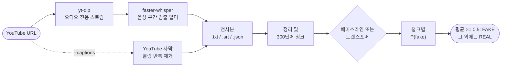

<div align="center">

🇺🇸 [English](README.md) | 🇨🇳 [简体中文](README.zh-CN.md) | 🇭🇰 [繁體中文](README.zh-HK.md) | 🇯🇵 [日本語](README.ja.md) | 🇰🇷 **한국어**

# yt-fakenews-classifier

**YouTube 동영상을 전사하고, 그 전사본이 얼마나 REAL 뉴스 또는 FAKE 뉴스처럼 읽히는지 점수로 나타냅니다. 재현 가능한 TF-IDF 베이스라인과 선택적으로 쓸 수 있는 다국어 트랜스포머를 제공합니다.**

[](https://github.com/jumincho/yt-fakenews-classifier/actions/workflows/ci.yml)
[](LICENSE)
[](pyproject.toml)
[](https://colab.research.google.com/github/jumincho/yt-fakenews-classifier/blob/main/notebooks/colab_quickstart.ipynb)

</div>

## 개요

`ytfakenews`는 다음 일을 하는 명령줄 도구이자 Python 패키지입니다.

1. [yt-dlp](https://github.com/yt-dlp/yt-dlp)로 동영상의 오디오를 내려받아 [faster-whisper](https://github.com/SYSTRAN/faster-whisper)로 로컬에서 전사하거나, 동영상에 딸린 자막을 사용합니다.
2. 전사본을 정리하고 서로 겹치는 300단어 청크로 나눕니다.
3. REAL 또는 FAKE 레이블이 붙은 뉴스 기사로 학습한 분류기를 사용해 모든 청크에 점수를 매기고, 평균 P(fake)를 판정 결과로 삼아 청크별 점수와 함께 보고합니다.

두 분류기는 같은 인터페이스를 공유합니다. 하나는 CPU에서 약 20초 만에 학습되는 TF-IDF + 로지스틱 회귀 **베이스라인**(테스트 정확도 0.957, F1 0.958)이고, 다른 하나는 GPU가 있는 사용자를 위한 파인튜닝된 **XLM-RoBERTa** 인코더입니다.

> [!IMPORTANT]
> 이 분류기가 학습한 것은 2016년 무렵의 FAKE와 REAL *기사*가 어떤 모습인지, 즉 그 문체와 어휘, 그리고 기사를 수집한 웹사이트의 흔적입니다. 사실관계는 확인하지 않습니다. 음성 전사본에 대한 판정은 문체상의 신호이지 진위에 대한 판단이 아닙니다. 결과를 사용하기 전에 [모델 카드](#모델-카드와-한계)를 읽으십시오.

## 작동 방식



- **다운로드**: yt-dlp의 Python API가 가장 좋은 오디오 전용 스트림을 가져옵니다. 아무것도 다시 인코딩하지 않으므로 ffmpeg 없이 동작합니다. URL 대신 로컬 오디오 파일이나 동영상 파일을 쓸 수도 있습니다.
- **음성 인식**: faster-whisper는 CTranslate2에서 Whisper(기본값은 `small` 모델)를 Silero 음성 구간 검출 필터와 함께 실행하고 PyAV로 오디오를 디코딩하므로, ffmpeg도 PyTorch도 필요하지 않습니다. `--translate`를 지정하면 Whisper가 곧바로 영어로 전사합니다.
- **자막**(`--captions`): YouTube의 자동 자막보다 업로더가 올린 자막을 우선합니다. 자동 자막에서 롤링 방식 때문에 반복되는 부분은 제거하고, YouTube가 기계 번역한 트랙은 전사본 JSON에 표시합니다.
- **정리 및 청크 분할**: 타임스탬프, 마크업, `[Music]` 같은 주석, `>>` 화자 표시를 제거합니다. 그다음 이웃한 윈도우끼리 최소 50단어씩 겹치도록 하면서 가장 적은 수의 300단어 윈도우로 텍스트 전체를 덮습니다. 윈도우는 균등한 간격으로 배치되므로 끝에 짧은 청크가 남지 않습니다.
- **분류**: 각 청크마다 P(fake)가 매겨집니다. 전사본의 P(fake)는 그 평균이며, 평균이 0.5 이상(`--threshold`)이면 레이블은 FAKE입니다. 평균은 동영상의 모든 부분에 같은 가중치를 줍니다. 청크별 점수를 보면 판정이 어디에서 비롯되었는지 알 수 있습니다.

## 빠른 시작

```bash
git clone https://github.com/jumincho/yt-fakenews-classifier.git
cd yt-fakenews-classifier
python -m venv .venv && source .venv/bin/activate
pip install -e ".[asr]"

ytfakenews train baseline      # CPU에서 약 20초, models/baseline/에 저장
ytfakenews run "https://www.youtube.com/watch?v=VIDEO_ID"
```

`run`은 전사본을 `outputs/<video id>.txt`, `.srt`, `.json`으로 저장하고 판정 결과를 청크별 점수와 함께 출력합니다. 처음 전사할 때는 Hugging Face Hub에서 Whisper 모델을 내려받습니다. Whisper를 건너뛰려면 `--captions`를, 말하는 언어를 자동 감지하지 않고 직접 지정하려면 `--language ko`를, 더 나은 전사본을 얻으려면 `--whisper-model large-v3`를 사용하십시오. [Colab 빠른 시작](notebooks/colab_quickstart.ipynb)은 같은 단계를 브라우저에서 실행합니다.

[`examples/`](examples/)에 있는 가상의 전사본 두 개를 하나의 텍스트로 읽어 위에서 학습한 베이스라인으로 점수를 매기면 다음과 같이 출력됩니다.

```console
$ cat examples/transcript_local_news.txt examples/transcript_sensational.txt \
    | ytfakenews predict - --chunk-words 150 --overlap 30
FAKE  P(fake) = 0.699  (threshold 0.50, mean over 4 chunks)
model: models/baseline (baseline); input: 503 words

chunk  words        P(fake)  preview
    1  0-150          0.539  Good evening, and thanks for joining us. I'm at City Hall, where ...
    2  117-267        0.368  the public library and keeps property tax rates unchanged. City staff presented ...
    3  235-385        0.923  weekend, the farmers market returns on Saturday morning at the fairgrounds, and ...
    4  353-503        0.967  leave the house. And who gets that data? Nobody will answer that ...
```

따로 점수를 매기면 [지역 뉴스 전사본](examples/transcript_local_news.txt)은 REAL(P(fake) = 0.356), [선정적인 전사본](examples/transcript_sensational.txt)은 FAKE(0.977)로 레이블됩니다. 두 전사본 모두 이 저장소를 위해 작성한 것이며 실제로 있었던 일은 전혀 다루지 않습니다.

### 설치 옵션

| 설치 | 사용 가능한 기능 | 주요 의존성 |
| --- | --- | --- |
| `pip install -e .` | `train baseline`, `evaluate`, `predict` | numpy, pandas, scikit-learn, joblib |
| `pip install -e ".[asr]"` | `transcribe`, `run` | yt-dlp(yt-dlp-ejs 및 Deno 포함), faster-whisper |
| `pip install -e ".[transformer]"` | 트랜스포머 백엔드 | PyTorch, transformers, accelerate |
| `pip install -e ".[dev]"` | 테스트와 린터 | pytest, ruff, mypy |

이 패키지는 PyPI에 배포되어 있지 않습니다. 저장소를 클론하지 않은 환경에서는 GitHub에서 설치하며(예: `pip install "ytfakenews[asr] @ git+https://github.com/jumincho/yt-fakenews-classifier"`), 이때는 데이터셋이 저장소 안에 있으므로 학습에 `--data PATH`가 필요합니다. 설치되지 않은 extra(선택적 의존성)가 필요한 명령은 어떤 extra를 설치해야 하는지 알려 줍니다. 최신 yt-dlp는 YouTube를 완전히 지원하려면 JavaScript 런타임이 필요한데, `asr` extra가 yt-dlp 자체의 extra를 통해 이 런타임(Deno)을 설치합니다. YouTube 다운로드가 실패하기 시작하면 먼저 yt-dlp를 업데이트하십시오.

### Python API

```python
from ytfakenews import classify_text, load_classifier
from ytfakenews.text import read_transcript

classifier = load_classifier("models/baseline")
prediction = classify_text(read_transcript("examples/transcript_sensational.txt"), classifier)
print(prediction.label, round(prediction.p_fake, 3))  # FAKE 0.977
for chunk in prediction.chunks:
    print(chunk.start_word, chunk.end_word, round(chunk.p_fake, 3))
```

## 학습과 평가

### 데이터

[`data/fake_or_real_news.zip`](data/fake_or_real_news.zip)은 공개 데이터셋인 fake_or_real_news(Kaggle을 통해 배포)입니다. 대부분 2016년 선거 전후의 미국 정치를 다룬 영어 뉴스 기사로, 각 기사에 REAL 또는 FAKE 레이블이 붙어 있습니다. 데이터는 ZIP 파일에서 바로 읽습니다. 전사본에는 헤드라인이 없으므로 모델은 헤드라인을 보지 않고 기사 본문만 봅니다.

| 정리 단계 | 기사 수 |
| --- | ---: |
| CSV의 행 | 6,335 (REAL 3,171, FAKE 3,164) |
| 본문이 비어 있어 제외 | 36 (모두 FAKE) |
| 같은 본문에 두 레이블이 모두 있어 제외 | 0 |
| 본문 중복, 뒤에 나온 사본 제외 | 241 (그중 29건은 제목, 본문, 레이블이 모두 같음) |
| **남은 기사** | **6,058 (REAL 2,989, FAKE 3,069)** |
| 층화 분할, 시드 42 | 학습 4,846, 검증 606, 테스트 606 |

중복 본문을 제거하는 것이 중요한 이유는 일부 본문이 서로 다른 여러 제목으로 등장하기 때문입니다. 분할의 양쪽에 사본이 하나씩 있으면 테스트 점수가 부풀려집니다.

### 베이스라인 결과

단어 유니그램과 바이그램에 대한 TF-IDF(sublinear tf, `min_df` 3, `max_df` 0.9, 특성 209,137개)를 로지스틱 회귀(liblinear, C = 32)에 입력합니다. 정밀도, 재현율, F1은 FAKE를 양성 클래스로 계산합니다. 모든 행은 저장소 루트에서 실행한 다음 명령으로 얻은 것입니다.

```bash
ytfakenews train baseline               # 기본 시드 42, 검증 및 테스트 행
ytfakenews evaluate --chunked           # 전사본 경로: 정리, 300단어 청크, 평균
ytfakenews evaluate --max-words 100     # 각 기사의 처음 100단어만 사용(50, 200, 300도 가능)
```

| 분할 및 입력 | n | 정확도 | 정밀도 | 재현율 | F1 | ROC-AUC |
| --- | ---: | ---: | ---: | ---: | ---: | ---: |
| 검증, 기사 전체 | 606 | 0.9505 | 0.9453 | 0.9577 | 0.9515 | 0.9900 |
| **테스트, 기사 전체** | 606 | **0.9571** | **0.9547** | **0.9609** | **0.9578** | **0.9895** |
| 테스트, 300단어 청크 평균 | 606 | 0.9389 | 0.9116 | 0.9739 | 0.9417 | 0.9853 |
| 테스트, 처음 300단어 | 606 | 0.9323 | 0.8982 | 0.9772 | 0.9360 | 0.9830 |
| 테스트, 처음 200단어 | 606 | 0.9125 | 0.8671 | 0.9772 | 0.9188 | 0.9817 |
| 테스트, 처음 100단어 | 606 | 0.8498 | 0.7784 | 0.9837 | 0.8691 | 0.9759 |
| 테스트, 처음 50단어 | 606 | 0.7970 | 0.7170 | 0.9902 | 0.8317 | 0.9664 |

테스트 기사 전체에서는 REAL 기사 299건 중 285건, FAKE 기사 307건 중 295건이 올바르게 분류됩니다. 입력이 짧아지면 REAL 기사가 FAKE 쪽으로 밀립니다. 청크 경로는 REAL 테스트 기사 299건 중 29건을 FAKE로 레이블하고, 처음 100단어만 쓰면 이 수가 86건이 되지만, FAKE 재현율은 0.97보다 높게 유지됩니다. ROC-AUC는 정확도보다 훨씬 적게 떨어지는데, 이는 짧은 입력에 맞춰 보정한 임계값이 손실의 일부를 되찾을 수 있음을 시사합니다. 다만 이는 구현되어 있지 않습니다.

C는 검증 세트에서 골랐습니다. 검증 세트의 F1은 C = 4일 때 0.9353, 16일 때 0.9467, 32일 때 0.9515, 128일 때 0.9498입니다(`ytfakenews train baseline --C 16` 등). 테스트 세트는 어떤 선택에도 쓰지 않았습니다. 수치는 Python 3.12, scikit-learn 1.9.1, NumPy 2.5.3, pandas 3.0.6으로 측정했습니다. CI는 푸시할 때마다 베이스라인을 다시 학습하고, 테스트 지표를 작업 요약에 기록하며, `metrics.json` 파일을 아티팩트로 업로드합니다.

### 트랜스포머 모델

트랜스포머는 아직 전체 규모로 파인튜닝하지 않았으므로 **트랜스포머 결과는 보고하지 않습니다**. CI는 무작위로 초기화한 아주 작은 모델로 학습, 저장, 불러오기, 예측의 전체 경로를 CPU에서 실행합니다. GPU(예: 무료 Colab T4)에서 수치를 얻으려면 다음을 실행하십시오.

```bash
pip install -e ".[transformer]"
ytfakenews train transformer                        # xlm-roberta-base, 시드 42, 같은 분할
ytfakenews evaluate --model models/transformer --chunked
```

기본값은 다음과 같습니다. 입력은 512토큰이며 긴 기사는 앞뒤를 남기고 잘라냅니다(처음 128토큰과 마지막 382토큰). 배치 크기는 8, 그래디언트 누적은 2단계이고, 학습률은 2e-5에 10% 워밍업과 가중치 감쇠 0.01을 적용합니다. 최대 4에포크까지 학습하며, 검증 F1이 2에포크 동안 나아지지 않으면 조기 종료합니다. CUDA에서는 fp16을 사용하고 시드는 42입니다. `models/transformer/metrics.json`에는 검증 및 테스트 지표와 학습 로그가 저장됩니다. `--model-name`에는 Hugging Face Hub나 로컬 디렉터리에 있는 어떤 인코더든 지정할 수 있으며, `symanto/xlm-roberta-base-snli-mnli-anli-xnli` 같은 NLI 체크포인트도 가능합니다. 이 경우 3클래스 헤드는 새 REAL/FAKE 헤드로 교체됩니다.

다국어 모델을 쓰는 이유: XLM-RoBERTa는 공유 어휘로 약 100개 언어를 사전 학습했으므로, 영어 기사로 파인튜닝한 분류기를 예를 들어 한국어 전사본에도 적용할 수 있습니다(제로샷 교차 언어 전이). 이 전이가 이 작업에서 통하는지는 검증되지 않았습니다. 영어가 아닌 동영상을 위한 또 다른 방법은 `--translate`로, 어느 백엔드를 쓰든 Whisper가 영어 전사본을 만들게 합니다.

## CLI 레퍼런스

모든 명령에 `--help`가 있습니다. `-v`는 디버그 출력을 보여 주고 `-q`는 진행 메시지를 숨깁니다. 종료 코드는 성공하면 0, 오류가 나면 1(stderr에 한 줄로 보고), 인수가 잘못되면 2입니다.

| 명령 | 하는 일 | 주로 쓰는 옵션 |
| --- | --- | --- |
| `ytfakenews transcribe URL_OR_FILE` | `<id>.txt`, `.srt`, `.json`을 `outputs/`에 저장 | `--captions`, `--language`, `--translate`, `--whisper-model`, `--device`, `--compute-type`, `--keep-audio`, `-o` |
| `ytfakenews train baseline` | 베이스라인을 학습, 평가, 저장 | `--data`, `--seed`, `--val-size`, `--test-size`, `--C`, `--min-df`, `--max-df`, `--ngram-max`, `--output-dir` |
| `ytfakenews train transformer` | 트랜스포머를 파인튜닝, 평가, 저장 | `--model-name`, `--epochs`, `--patience`, `--batch-size`, `--grad-accum`, `--lr`, `--max-length`, `--head-tokens`, `--max-train-samples`, `--fp16`/`--no-fp16`, `--cpu` |
| `ytfakenews evaluate` | 모델을 학습할 때 쓴 분할로 지표 계산 | `--model`, `--split`, `--chunked`, `--max-words`, `--json`, `--output` |
| `ytfakenews predict FILE` | `.txt`, `.srt`, `.vtt` 파일, `-`(표준 입력) 또는 `--text`를 분류 | `--model`, `--chunk-words`, `--overlap`, `--threshold`, `--device`, `--json` |
| `ytfakenews run URL_OR_FILE` | `transcribe` 후 `predict` | 두 명령의 옵션 |

`predict --json`은 판정 결과와 청크 점수를 출력합니다(여기서는 줄였습니다).

```json
{
  "model": {"path": "models/baseline", "backend": "baseline"},
  "prediction": {
    "label": "FAKE",
    "p_fake": 0.9772652175007179,
    "threshold": 0.5,
    "n_words": 238,
    "chunk_words": 300,
    "overlap": 50,
    "chunks": [{"index": 0, "start_word": 0, "end_word": 238, "p_fake": 0.9772652175007179, "preview": "Okay, everybody, listen up, ..."}],
    "n_chunks": 1,
    "aggregation": "mean"
  }
}
```

`run --json`은 여기에 `source`, `video`(ID, 제목, URL, 채널, 길이, 업로드 날짜), `transcript`(출처, 언어, 세부 정보, 세그먼트 수, 파일 경로)를 추가합니다.

학습된 모델 디렉터리에는 모델 파일, `metrics.json`, 그리고 백엔드와 설정, 데이터 출처(데이터셋 경로와 SHA-256, 정리 통계, 분할)를 기록한 `manifest.json`이 들어 있습니다. `evaluate`는 이 파일로 분할을 정확히 다시 만듭니다. 모델은 joblib(pickle) 또는 PyTorch로 불러오므로 신뢰할 수 있는 모델 디렉터리만 불러오십시오.

## 프로젝트 구조

```text
yt-fakenews-classifier/
├── src/ytfakenews/
│   ├── cli.py            명령줄 인터페이스
│   ├── transcribe.py     yt-dlp 다운로드, faster-whisper, YouTube 자막
│   ├── text.py           SRT/WebVTT 파싱, 정리, 청크 분할
│   ├── data.py           데이터셋 불러오기, 정리, 분할
│   ├── baseline.py       TF-IDF + 로지스틱 회귀
│   ├── transformer.py    트랜스포머 파인튜닝과 추론(지연 임포트)
│   ├── predict.py        공통 분류기 인터페이스, 청크 집계
│   ├── evaluation.py     평가 지표
│   ├── artifacts.py      모델 디렉터리 매니페스트
│   ├── errors.py         사용자에게 보여 주는 예외
│   └── _optional.py      선택적 의존성 임포트
├── tests/                오프라인 pytest 테스트 모음과 픽스처
├── data/                 fake_or_real_news.zip
├── examples/             가상의 전사본 두 개
├── notebooks/            colab_quickstart.ipynb
├── .github/workflows/    ci.yml
└── pyproject.toml
```

## 개발

```bash
pip install -e ".[dev]"
ruff check . && ruff format --check .
mypy        # strict 모드, 대상은 src/ytfakenews
pytest      # 오프라인, extra가 필요한 테스트는 그 extra가 없으면 건너뜀
```

전체 테스트 모음에는 트랜스포머 스모크 테스트(무작위로 초기화한 작은 BERT와 즉석에서 만든 토크나이저 사용)가 추가되고, 로컬 HTTP 서버를 상대로 실제 yt-dlp와 faster-whisper도 검사합니다.

```bash
pip install torch --index-url https://download.pytorch.org/whl/cpu
pip install -e ".[asr,transformer,dev]"
YTFAKENEWS_REQUIRE_EXTRAS=1 HF_HUB_OFFLINE=1 pytest
```

[CI](.github/workflows/ci.yml)는 Python 3.10, 3.12, 3.13에서 린터, 타입 체커, 테스트를 실행하고, 함께 제공되는 데이터로 베이스라인을 다시 학습하며, `pyproject.toml`이 허용하는 가장 오래된 의존성 버전을 테스트하고, CPU 전용 PyTorch로 전체 테스트 모음을 실행합니다.

## 모델 카드와 한계

- **의도된 용도**: 교육과 실험, 예를 들어 한 도메인에서 학습한 분류기가 다른 도메인에서 어떻게 동작하는지 연구하는 용도입니다. 콘텐츠 모더레이션, 팩트체크, 사람이나 채널에 관한 결정에는 적합하지 않습니다.
- **학습 데이터**: 약 6천 건의 영어 기사로, 대부분 2016년 선거 전후의 미국 정치를 다루며, 각 기사 전체에 REAL 또는 FAKE 레이블이 붙어 있습니다. 다른 시기, 주제, 국가는 분포 밖에 있습니다.
- **베이스라인이 학습한 것**: 가장 강한 FAKE 특성에는 "2016", "october", "november 2016", "share", "print", "via", "source"가 있고, 가장 강한 REAL 특성에는 "said", "percent", "tuesday", "gop", "sen"이 있습니다(전체 목록은 학습 후 `models/baseline/metrics.json`에 있습니다). 이들은 날짜, 수집된 웹 페이지의 잔재, 통신사 기사 특유의 표현으로, 텍스트가 어디서 언제 발행되었는지에 관한 단서이지 그 내용이 사실인지에 관한 단서가 아닙니다. 높은 테스트 점수가 주로 보여 주는 것은 이런 단서가 두 웹사이트 집단을 얼마나 잘 구분하는지입니다.
- **기사에서 음성으로**: 전사본에는 헤드라인이나 바이라인이 없고, 구어체를 쓰며, 인식 오류가 있고 문장 부호가 거의 없습니다. 점수는 전사본에 맞게 보정되어 있지 않습니다. 기사에서도 이미 청크 분할과 짧은 입력이 예측을 FAKE 쪽으로 옮기므로(결과 표 참고), 짧은 동영상일수록 FAKE로 레이블될 가능성이 큽니다.
- **언어**: 학습 데이터는 영어입니다. `--translate`와 다국어 트랜스포머는 다른 언어를 처리하는 두 가지 방법이지만, 어느 쪽도 이 작업에 대해 평가되지 않았습니다.
- **전사본**: Whisper와 YouTube 자동 자막 모두 인식 오류를 냅니다. 또한 실제로 말한 언어가 아닌 다른 언어의 자동 자막은 기계 번역입니다.
- **레이블은 사실 판정이 아님**: FAKE는 "학습 데이터의 FAKE 기사와 닮았다"는 뜻입니다. 이를 동영상이 거짓이라는 주장으로 공표하거나 그에 근거해 행동하지 마십시오.

## 라이선스

코드는 [MIT 라이선스](LICENSE)에 따라 배포됩니다(copyright (c) 2023 jumincho). 함께 제공되는 데이터셋은 Kaggle에 공개된 그대로 재배포되며 이 라이선스의 적용을 받지 않습니다.
