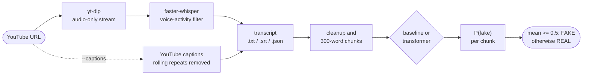

<div align="center">

🇺🇸 **English** | 🇨🇳 [简体中文](README.zh-CN.md) | 🇭🇰 [繁體中文](README.zh-HK.md) | 🇯🇵 [日本語](README.ja.md) | 🇰🇷 [한국어](README.ko.md)

# yt-fakenews-classifier

**Transcribe a YouTube video and score how much its transcript reads like REAL or FAKE news,
with a reproducible TF-IDF baseline and an optional multilingual transformer.**

[](https://github.com/jumincho/yt-fakenews-classifier/actions/workflows/ci.yml)
[](LICENSE)
[](pyproject.toml)
[](https://colab.research.google.com/github/jumincho/yt-fakenews-classifier/blob/main/notebooks/colab_quickstart.ipynb)

</div>

## Overview

`ytfakenews` is a command-line tool and Python package that

1. downloads a video's audio with [yt-dlp](https://github.com/yt-dlp/yt-dlp) and transcribes it
   locally with [faster-whisper](https://github.com/SYSTRAN/faster-whisper), or uses the video's
   own captions;
2. cleans the transcript and splits it into overlapping 300-word chunks;
3. scores every chunk with a classifier trained on news articles labelled REAL or FAKE and
   reports the mean P(fake) as the verdict, together with the per-chunk scores.

Two classifiers share one interface: a TF-IDF + logistic-regression **baseline** that trains
in about 20 seconds on a CPU (test accuracy 0.957, F1 0.958) and a fine-tuned **XLM-RoBERTa**
encoder for users with a GPU.

> [!IMPORTANT]
> The classifier learned what 2016-era FAKE and REAL *articles* look like: their style,
> vocabulary and traces of the websites they were collected from. It does not check facts.
> On a spoken transcript its verdict is a style signal, not a judgement of truth. Read the
> [model card](#model-card-and-limitations) before you use a result.

## How it works



- **Download.** yt-dlp's Python API fetches the best audio-only stream. Nothing is re-encoded,
  so ffmpeg is not needed. A local audio or video file can be used instead of a URL.
- **Speech-to-text.** faster-whisper runs Whisper on CTranslate2 with the Silero
  voice-activity filter (the `small` model by default) and decodes audio with PyAV, so it
  needs neither ffmpeg nor PyTorch. `--translate` makes Whisper transcribe straight into
  English.
- **Captions** (`--captions`). The uploader's subtitles are preferred over YouTube's automatic
  captions. The rolling repeats of automatic captions are removed, and tracks that YouTube
  machine-translated are flagged in the transcript's JSON.
- **Cleanup and chunking.** Timestamps, markup, annotations such as `[Music]` and `>>` speaker
  markers are removed. The text is then covered by the fewest 300-word windows that overlap by
  at least 50 words; the windows are evenly spaced, so there is no short tail chunk.
- **Classification.** Every chunk gets a P(fake). The transcript's P(fake) is their mean and
  the label is FAKE when the mean is at least 0.5 (`--threshold`). The mean weighs every part
  of a video equally; the per-chunk scores show where a verdict comes from.

## Quickstart

```bash
git clone https://github.com/jumincho/yt-fakenews-classifier.git
cd yt-fakenews-classifier
python -m venv .venv && source .venv/bin/activate
pip install -e ".[asr]"

ytfakenews train baseline      # about 20 seconds on a CPU; writes models/baseline/
ytfakenews run "https://www.youtube.com/watch?v=VIDEO_ID"
```

`run` saves the transcript as `outputs/<video id>.txt`, `.srt` and `.json` and prints the
verdict with the per-chunk scores. The first transcription downloads the Whisper model from
the Hugging Face Hub. Use `--captions` to skip Whisper, `--language ko` to name the spoken
language instead of detecting it, or `--whisper-model large-v3` for better transcripts. The
[Colab quickstart](notebooks/colab_quickstart.ipynb) runs the same steps in the browser.

This is what the output looks like for the two fictional transcripts in
[`examples/`](examples/) read as one text, scored by the baseline trained above:

```console
$ cat examples/transcript_local_news.txt examples/transcript_sensational.txt \
    | ytfakenews predict - --chunk-words 150 --overlap 30
FAKE  P(fake) = 0.699  (threshold 0.50, mean over 4 chunks)
model: models/baseline (baseline); input: 503 words

chunk  words        P(fake)  preview
    1  0-150          0.539  Good evening, and thanks for joining us. I'm at City Hall, where ...
    2  117-267        0.368  the public library and keeps property tax rates unchanged. City staff presented ...
    3  235-385        0.923  weekend, the farmers market returns on Saturday morning at the fairgrounds, and ...
    4  353-503        0.967  leave the house. And who gets that data? Nobody will answer that ...
```

Scored separately, the [local-news transcript](examples/transcript_local_news.txt) is
labelled REAL (P(fake) = 0.356) and the [sensational one](examples/transcript_sensational.txt)
FAKE (0.977). Both were written for this repository and describe nothing real.

### Installation options

| Install | Enables | Main dependencies |
| --- | --- | --- |
| `pip install -e .` | `train baseline`, `evaluate`, `predict` | numpy, pandas, scikit-learn, joblib |
| `pip install -e ".[asr]"` | `transcribe`, `run` | yt-dlp (with yt-dlp-ejs and Deno), faster-whisper |
| `pip install -e ".[transformer]"` | the transformer backend | PyTorch, transformers, accelerate |
| `pip install -e ".[dev]"` | tests and linters | pytest, ruff, mypy |

The package is not published on PyPI. Outside a clone it installs from GitHub, for example
`pip install "ytfakenews[asr] @ git+https://github.com/jumincho/yt-fakenews-classifier"`;
training then needs `--data PATH` because the dataset lives in the repository. A command that
needs a missing extra says which one to install. Recent yt-dlp versions need a JavaScript
runtime for full YouTube support, which the `asr` extra installs (Deno) through yt-dlp's own
extras. If YouTube downloads start to fail, update yt-dlp first.

### Python API

```python
from ytfakenews import classify_text, load_classifier
from ytfakenews.text import read_transcript

classifier = load_classifier("models/baseline")
prediction = classify_text(read_transcript("examples/transcript_sensational.txt"), classifier)
print(prediction.label, round(prediction.p_fake, 3))  # FAKE 0.977
for chunk in prediction.chunks:
    print(chunk.start_word, chunk.end_word, round(chunk.p_fake, 3))
```

## Training and evaluation

### Data

[`data/fake_or_real_news.zip`](data/fake_or_real_news.zip) is the public fake_or_real_news
dataset (distributed via Kaggle): English news articles, mostly about US politics around the
2016 election, each labelled REAL or FAKE. It is read straight from the ZIP. The models see
the article body only, not the headline, because transcripts have no headline.

| Cleaning step | Articles |
| --- | ---: |
| Rows in the CSV | 6,335 (REAL 3,171, FAKE 3,164) |
| Empty body, dropped | 36 (all FAKE) |
| Same body with both labels, dropped | 0 |
| Repeated body, later copies dropped | 241 (29 of them identical in title, body and label) |
| **Kept** | **6,058 (REAL 2,989, FAKE 3,069)** |
| Stratified split, seed 42 | 4,846 train, 606 validation, 606 test |

Removing repeated bodies matters because some bodies appear under several different titles; a
copy on each side of the split would inflate the test scores.

### Baseline results

TF-IDF over word uni- and bigrams (sublinear tf, `min_df` 3, `max_df` 0.9, 209,137 features)
feeds a logistic regression (liblinear, C = 32). Precision, recall and F1 treat FAKE as the
positive class. Every row comes from these commands, run from the repository root:

```bash
ytfakenews train baseline               # seed 42 by default; validation and test rows
ytfakenews evaluate --chunked           # the transcript path: cleanup, 300-word chunks, mean
ytfakenews evaluate --max-words 100     # only the first 100 words of each article (also 50, 200, 300)
```

| Split and input | n | Accuracy | Precision | Recall | F1 | ROC-AUC |
| --- | ---: | ---: | ---: | ---: | ---: | ---: |
| Validation, full article | 606 | 0.9505 | 0.9453 | 0.9577 | 0.9515 | 0.9900 |
| **Test, full article** | 606 | **0.9571** | **0.9547** | **0.9609** | **0.9578** | **0.9895** |
| Test, 300-word chunks averaged | 606 | 0.9389 | 0.9116 | 0.9739 | 0.9417 | 0.9853 |
| Test, first 300 words | 606 | 0.9323 | 0.8982 | 0.9772 | 0.9360 | 0.9830 |
| Test, first 200 words | 606 | 0.9125 | 0.8671 | 0.9772 | 0.9188 | 0.9817 |
| Test, first 100 words | 606 | 0.8498 | 0.7784 | 0.9837 | 0.8691 | 0.9759 |
| Test, first 50 words | 606 | 0.7970 | 0.7170 | 0.9902 | 0.8317 | 0.9664 |

On the full test articles, 285 of 299 REAL and 295 of 307 FAKE articles are classified
correctly. Shorter inputs push REAL articles towards FAKE: the chunked path labels 29 of the
299 REAL test articles FAKE, and with only the first 100 words it is 86, while FAKE recall
stays above 0.97. ROC-AUC falls much less than accuracy, which suggests that a threshold
calibrated for short inputs would recover part of the loss; that is not implemented.

C was chosen on the validation split, where F1 is 0.9353 at C = 4, 0.9467 at 16, 0.9515 at 32
and 0.9498 at 128 (`ytfakenews train baseline --C 16`, and so on). The test split was not used
for any choice. The numbers were measured with Python 3.12, scikit-learn 1.9.1, NumPy 2.5.3
and pandas 3.0.6. CI retrains the baseline on every push, puts the test metrics in the job
summary and uploads the `metrics.json` files as an artifact.

### Transformer

The transformer has not been fine-tuned at full scale yet, so **no transformer results are
reported**. CI runs the complete training, saving, loading and prediction path with a tiny,
randomly initialised model on a CPU. To produce the numbers on a GPU, for example a free Colab
T4:

```bash
pip install -e ".[transformer]"
ytfakenews train transformer                        # xlm-roberta-base, seed 42, same split
ytfakenews evaluate --model models/transformer --chunked
```

The defaults are 512-token inputs with head+tail truncation (the first 128 and the last 382
tokens of long articles), batch size 8 with 2 gradient-accumulation steps, learning rate 2e-5
with 10% warm-up and weight decay 0.01, and at most 4 epochs with early stopping after 2
epochs without a better validation F1; fp16 is used on CUDA and the seed is 42.
`models/transformer/metrics.json` stores the validation and test metrics and the training log.
`--model-name` accepts any encoder from the Hugging Face Hub or a local directory, including an
NLI checkpoint such as `symanto/xlm-roberta-base-snli-mnli-anli-xnli`, whose three-way head is
replaced by a new REAL/FAKE head.

Why a multilingual model: XLM-RoBERTa was pretrained on about 100 languages with a shared
vocabulary, so a classifier fine-tuned on English articles can be applied to, for example, a
Korean transcript (zero-shot cross-lingual transfer). Whether that transfer works for this
task is untested. The other route for non-English videos is `--translate`, which has Whisper
produce an English transcript for either backend.

## CLI reference

Every command has `--help`; `-v` shows debug output and `-q` hides progress messages. The exit
code is 0 on success, 1 on an error (reported in one line on stderr) and 2 for invalid
arguments.

| Command | What it does | Options you will use |
| --- | --- | --- |
| `ytfakenews transcribe URL_OR_FILE` | Writes `<id>.txt`, `.srt` and `.json` to `outputs/` | `--captions`, `--language`, `--translate`, `--whisper-model`, `--device`, `--compute-type`, `--keep-audio`, `-o` |
| `ytfakenews train baseline` | Trains, evaluates and saves the baseline | `--data`, `--seed`, `--val-size`, `--test-size`, `--C`, `--min-df`, `--max-df`, `--ngram-max`, `--output-dir` |
| `ytfakenews train transformer` | Fine-tunes, evaluates and saves a transformer | `--model-name`, `--epochs`, `--patience`, `--batch-size`, `--grad-accum`, `--lr`, `--max-length`, `--head-tokens`, `--max-train-samples`, `--fp16`/`--no-fp16`, `--cpu` |
| `ytfakenews evaluate` | Metrics on the split a model was trained with | `--model`, `--split`, `--chunked`, `--max-words`, `--json`, `--output` |
| `ytfakenews predict FILE` | Classifies a `.txt`, `.srt` or `.vtt` file, `-` for stdin, or `--text` | `--model`, `--chunk-words`, `--overlap`, `--threshold`, `--device`, `--json` |
| `ytfakenews run URL_OR_FILE` | `transcribe`, then `predict` | the options of both |

`predict --json` prints the verdict and the chunk scores (shortened here):

```json
{
  "model": {"path": "models/baseline", "backend": "baseline"},
  "prediction": {
    "label": "FAKE",
    "p_fake": 0.9772652175007179,
    "threshold": 0.5,
    "n_words": 238,
    "chunk_words": 300,
    "overlap": 50,
    "chunks": [{"index": 0, "start_word": 0, "end_word": 238, "p_fake": 0.9772652175007179, "preview": "Okay, everybody, listen up, ..."}],
    "n_chunks": 1,
    "aggregation": "mean"
  }
}
```

`run --json` adds `source`, `video` (id, title, URL, channel, duration, upload date) and
`transcript` (source, language, details, number of segments and file paths).

A trained model directory holds the model files, `metrics.json` and a `manifest.json` that
records the backend, the configuration and the data provenance (dataset path and SHA-256,
cleaning statistics and split); `evaluate` uses it to rebuild the exact split. Models are
loaded with joblib (pickle) or PyTorch, so only load model directories you trust.

## Project structure

```text
yt-fakenews-classifier/
├── src/ytfakenews/
│   ├── cli.py            command-line interface
│   ├── transcribe.py     yt-dlp download, faster-whisper, YouTube captions
│   ├── text.py           SRT/WebVTT parsing, cleanup, chunking
│   ├── data.py           dataset loading, cleaning and splitting
│   ├── baseline.py       TF-IDF + logistic regression
│   ├── transformer.py    transformer fine-tuning and inference (lazy imports)
│   ├── predict.py        common classifier interface, chunk aggregation
│   ├── evaluation.py     metrics
│   ├── artifacts.py      model directory manifest
│   ├── errors.py         user-facing exceptions
│   └── _optional.py      imports of optional dependencies
├── tests/                offline pytest suite and fixtures
├── data/                 fake_or_real_news.zip
├── examples/             two fictional transcripts
├── notebooks/            colab_quickstart.ipynb
├── .github/workflows/    ci.yml
└── pyproject.toml
```

## Development

```bash
pip install -e ".[dev]"
ruff check . && ruff format --check .
mypy        # strict, on src/ytfakenews
pytest      # offline; tests that need an extra are skipped without it
```

The full suite adds the transformer smoke test (a tiny random BERT with a tokenizer built on
the fly) and checks the real yt-dlp and faster-whisper against a local HTTP server:

```bash
pip install torch --index-url https://download.pytorch.org/whl/cpu
pip install -e ".[asr,transformer,dev]"
YTFAKENEWS_REQUIRE_EXTRAS=1 HF_HUB_OFFLINE=1 pytest
```

[CI](.github/workflows/ci.yml) runs the linters, the type checker and the tests on Python
3.10, 3.12 and 3.13, retrains the baseline on the bundled data, tests the oldest dependency
versions that `pyproject.toml` allows and runs the full suite with CPU-only PyTorch.

## Model card and limitations

- **Intended use.** Teaching and experiments, such as studying how a classifier trained in one
  domain behaves in another. It is not suitable for moderation, fact-checking or decisions
  about people or channels.
- **Training data.** About six thousand English articles, mostly on US politics around the
  2016 election, each labelled REAL or FAKE as a whole. Other periods, topics and countries
  are out of distribution.
- **What the baseline learned.** Its strongest FAKE features include "2016", "october",
  "november 2016", "share", "print", "via" and "source"; its strongest REAL features include
  "said", "percent", "tuesday", "gop" and "sen" (the full lists are in
  `models/baseline/metrics.json` after training). These are dates, leftovers of the collected
  web pages and wire-service phrasing: cues about where and when a text was published, not
  about whether it is true. The high test scores mostly show how well such cues separate the
  two groups of websites.
- **From articles to speech.** Transcripts have no headline or byline, use conversational
  language and contain recognition errors and little punctuation. The scores are not
  calibrated for them. Already on articles, chunking and short inputs shift predictions
  towards FAKE (see the results table), so a short video is more likely to be labelled FAKE.
- **Language.** The training data is English. `--translate` and the multilingual transformer
  are two ways to process other languages; neither has been evaluated for this task.
- **Transcripts.** Whisper and YouTube's automatic captions both make recognition errors, and
  automatic captions in a language other than the spoken one are machine translations.
- **A label is not a finding.** FAKE means "resembles the FAKE articles of the training set".
  Do not publish or act on it as a claim that a video is false.

## License

The code is released under the [MIT License](LICENSE), copyright (c) 2023 jumincho. The bundled
dataset is redistributed as published on Kaggle and is not covered by that license.
