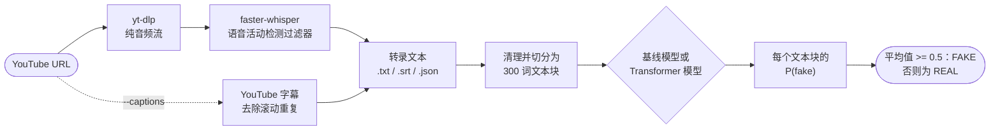

<div align="center">

🇺🇸 [English](README.md) | 🇨🇳 **简体中文** | 🇭🇰 [繁體中文](README.zh-HK.md) | 🇯🇵 [日本語](README.ja.md) | 🇰🇷 [한국어](README.ko.md)

# yt-fakenews-classifier

**转录 YouTube 视频，并为其转录文本打分，衡量它读起来有多像 REAL 或 FAKE 新闻；配有可复现的 TF-IDF 基线模型，以及可选的多语言 Transformer 模型。**

[](https://github.com/jumincho/yt-fakenews-classifier/actions/workflows/ci.yml)
[](LICENSE)
[](pyproject.toml)
[](https://colab.research.google.com/github/jumincho/yt-fakenews-classifier/blob/main/notebooks/colab_quickstart.ipynb)

</div>

## 概述

`ytfakenews` 是一个命令行工具兼 Python 包，它会：

1. 用 [yt-dlp](https://github.com/yt-dlp/yt-dlp) 下载视频的音频，并用 [faster-whisper](https://github.com/SYSTRAN/faster-whisper) 在本地转录，或者直接使用视频自带的字幕；
2. 清理转录文本，并将其切分为相互重叠的 300 词文本块；
3. 用一个在标注为 REAL 或 FAKE 的新闻文章上训练的分类器为每个文本块打分，把平均 P(fake) 作为判定结果报告出来，同时给出每个文本块的得分。

两种分类器共用同一套接口：一种是 TF-IDF + 逻辑回归**基线模型**，在 CPU 上训练约需 20 秒（测试集准确率 0.957，F1 0.958）；另一种是经过微调的 **XLM-RoBERTa** 编码器，供有 GPU 的用户使用。

> [!IMPORTANT]
> 本分类器学到的是 2016 年前后的 FAKE 和 REAL *文章*是什么样子：它们的文风、用词，以及采集这些文章的网站留下的痕迹。它不核查事实。用于语音转录文本时，它给出的判定只是一种文风信号，而不是对真假的判断。在使用任何结果之前，请先阅读[模型卡](#模型卡与局限性)。

## 工作原理



- **下载**：yt-dlp 的 Python API 获取最佳的纯音频流。整个过程不做任何重新编码，因此不需要 ffmpeg。也可以用本地的音频或视频文件代替 URL。
- **语音转文字**：faster-whisper 在 CTranslate2 上运行 Whisper（默认使用 `small` 模型），并启用 Silero 语音活动检测过滤器；它用 PyAV 解码音频，因此既不需要 ffmpeg，也不需要 PyTorch。`--translate` 会让 Whisper 直接转录成英文。
- **字幕**（`--captions`）：上传者提供的字幕优先于 YouTube 的自动字幕。自动字幕中因滚动显示而产生的重复内容会被去除；由 YouTube 机器翻译的字幕轨道会在转录文本的 JSON 中标注出来。
- **清理与分块**：时间戳、格式标签、`[Music]` 这类标注以及 `>>` 说话人标记都会被删除。随后，用尽可能少的 300 词窗口覆盖全文，相邻窗口至少重叠 50 词；各窗口间隔均匀，因此不会出现很短的末尾文本块。
- **分类**：每个文本块都会得到一个 P(fake)。转录文本的 P(fake) 是这些值的平均值；平均值至少为 0.5（`--threshold`）时，标签为 FAKE。取平均值意味着视频的每个部分权重相同；每个文本块的得分则显示判定结果从何而来。

## 快速开始

```bash
git clone https://github.com/jumincho/yt-fakenews-classifier.git
cd yt-fakenews-classifier
python -m venv .venv && source .venv/bin/activate
pip install -e ".[asr]"

ytfakenews train baseline      # 在 CPU 上约需 20 秒；写入 models/baseline/
ytfakenews run "https://www.youtube.com/watch?v=VIDEO_ID"
```

`run` 会把转录文本保存为 `outputs/<video id>.txt`、`.srt` 和 `.json`，并输出判定结果和每个文本块的得分。首次转录时会从 Hugging Face Hub 下载 Whisper 模型。使用 `--captions` 可以跳过 Whisper，使用 `--language ko` 可以直接指定语音的语言而不做自动检测，使用 `--whisper-model large-v3` 则可以得到质量更好的转录文本。[Colab 快速开始](notebooks/colab_quickstart.ipynb)会在浏览器中执行同样的步骤。

下面是把 [`examples/`](examples/) 中的两份虚构转录文本当作一篇文本读入、并用上面训练的基线模型打分后的输出：

```console
$ cat examples/transcript_local_news.txt examples/transcript_sensational.txt \
    | ytfakenews predict - --chunk-words 150 --overlap 30
FAKE  P(fake) = 0.699  (threshold 0.50, mean over 4 chunks)
model: models/baseline (baseline); input: 503 words

chunk  words        P(fake)  preview
    1  0-150          0.539  Good evening, and thanks for joining us. I'm at City Hall, where ...
    2  117-267        0.368  the public library and keeps property tax rates unchanged. City staff presented ...
    3  235-385        0.923  weekend, the farmers market returns on Saturday morning at the fairgrounds, and ...
    4  353-503        0.967  leave the house. And who gets that data? Nobody will answer that ...
```

分别打分时，[地方新闻转录文本](examples/transcript_local_news.txt)被标为 REAL（P(fake) = 0.356），[耸人听闻的那一份](examples/transcript_sensational.txt)被标为 FAKE（0.977）。两份文本都是为本仓库编写的，所述内容均非真实。

### 安装选项

| 安装方式 | 启用的功能 | 主要依赖 |
| --- | --- | --- |
| `pip install -e .` | `train baseline`、`evaluate`、`predict` | numpy、pandas、scikit-learn、joblib |
| `pip install -e ".[asr]"` | `transcribe`、`run` | yt-dlp（含 yt-dlp-ejs 和 Deno）、faster-whisper |
| `pip install -e ".[transformer]"` | Transformer 后端 | PyTorch、transformers、accelerate |
| `pip install -e ".[dev]"` | 测试和代码检查工具 | pytest、ruff、mypy |

本软件包没有发布到 PyPI。如果不在克隆下来的仓库中，可以直接从 GitHub 安装，例如 `pip install "ytfakenews[asr] @ git+https://github.com/jumincho/yt-fakenews-classifier"`；此时训练需要加上 `--data PATH`，因为数据集位于仓库中。如果某个命令需要尚未安装的可选依赖（extra），它会提示应安装哪一个。较新的 yt-dlp 版本需要 JavaScript 运行时才能完整支持 YouTube，`asr` 可选依赖会通过 yt-dlp 自身的可选依赖安装这个运行时（Deno）。如果 YouTube 下载开始失败，请先更新 yt-dlp。

### Python API

```python
from ytfakenews import classify_text, load_classifier
from ytfakenews.text import read_transcript

classifier = load_classifier("models/baseline")
prediction = classify_text(read_transcript("examples/transcript_sensational.txt"), classifier)
print(prediction.label, round(prediction.p_fake, 3))  # FAKE 0.977
for chunk in prediction.chunks:
    print(chunk.start_word, chunk.end_word, round(chunk.p_fake, 3))
```

## 训练与评估

### 数据

[`data/fake_or_real_news.zip`](data/fake_or_real_news.zip) 是公开的 fake_or_real_news 数据集（通过 Kaggle 分发）：英文新闻文章，大多与 2016 年大选前后的美国政治有关，每篇都标注为 REAL 或 FAKE。数据直接从 ZIP 文件中读取。模型只看文章正文，不看标题，因为转录文本没有标题。

| 清洗步骤 | 文章数 |
| --- | ---: |
| CSV 中的行数 | 6,335（REAL 3,171，FAKE 3,164） |
| 正文为空，已删除 | 36（全部为 FAKE） |
| 同一正文同时带有两种标签，已删除 | 0 |
| 正文重复，删除靠后的副本 | 241（其中 29 篇的标题、正文和标签完全相同） |
| **保留** | **6,058（REAL 2,989，FAKE 3,069）** |
| 分层划分，随机种子 42 | 训练集 4,846，验证集 606，测试集 606 |

删除重复正文很重要，因为有些正文以多个不同的标题出现；如果同一正文的副本分别落在划分的两侧，测试分数就会虚高。

### 基线模型结果

对单词的一元组和二元组计算 TF-IDF（次线性 tf，`min_df` 取 3，`max_df` 取 0.9，共 209,137 个特征），再送入逻辑回归（liblinear，C = 32）。精确率、召回率和 F1 均以 FAKE 为正类。表中每一行都来自下列命令，均在仓库根目录下运行：

```bash
ytfakenews train baseline               # 默认随机种子为 42；对应验证集和测试集的行
ytfakenews evaluate --chunked           # 转录文本的处理路径：清理、300 词文本块、取平均
ytfakenews evaluate --max-words 100     # 每篇文章只取前 100 词（另有 50、200、300）
```

| 数据划分与输入 | n | 准确率 | 精确率 | 召回率 | F1 | ROC-AUC |
| --- | ---: | ---: | ---: | ---: | ---: | ---: |
| 验证集，完整文章 | 606 | 0.9505 | 0.9453 | 0.9577 | 0.9515 | 0.9900 |
| **测试集，完整文章** | 606 | **0.9571** | **0.9547** | **0.9609** | **0.9578** | **0.9895** |
| 测试集，300 词文本块取平均 | 606 | 0.9389 | 0.9116 | 0.9739 | 0.9417 | 0.9853 |
| 测试集，前 300 词 | 606 | 0.9323 | 0.8982 | 0.9772 | 0.9360 | 0.9830 |
| 测试集，前 200 词 | 606 | 0.9125 | 0.8671 | 0.9772 | 0.9188 | 0.9817 |
| 测试集，前 100 词 | 606 | 0.8498 | 0.7784 | 0.9837 | 0.8691 | 0.9759 |
| 测试集，前 50 词 | 606 | 0.7970 | 0.7170 | 0.9902 | 0.8317 | 0.9664 |

在完整的测试集文章上，299 篇 REAL 文章中有 285 篇、307 篇 FAKE 文章中有 295 篇被正确分类。较短的输入会把 REAL 文章推向 FAKE：分块路径把 299 篇 REAL 测试文章中的 29 篇标为 FAKE，只取前 100 词时则为 86 篇，而 FAKE 的召回率始终保持在 0.97 以上。ROC-AUC 的降幅远小于准确率，这意味着针对短输入校准的阈值有望挽回一部分损失；不过这一点尚未实现。

C 是在验证集上选定的：C = 4 时 F1 为 0.9353，16 时为 0.9467，32 时为 0.9515，128 时为 0.9498（`ytfakenews train baseline --C 16`，依此类推）。测试集没有用于任何选择。以上数字是在 Python 3.12、scikit-learn 1.9.1、NumPy 2.5.3 和 pandas 3.0.6 环境下测得的。CI 在每次推送时都会重新训练基线模型，把测试集指标写入作业摘要，并将 `metrics.json` 文件作为工件上传。

### Transformer 模型

Transformer 模型尚未以完整规模进行微调，因此**这里不报告任何 Transformer 模型的结果**。CI 会在 CPU 上用一个随机初始化的微型模型跑通完整的训练、保存、加载和预测流程。如需在 GPU 上（例如免费的 Colab T4）得出这些数字：

```bash
pip install -e ".[transformer]"
ytfakenews train transformer                        # xlm-roberta-base，随机种子 42，相同的数据划分
ytfakenews evaluate --model models/transformer --chunked
```

默认设置为：输入 512 个 token，采用首尾截断（长文章保留开头 128 个和结尾 382 个 token）；批大小 8，梯度累积 2 步；学习率 2e-5，预热 10%，权重衰减 0.01；最多训练 4 轮，若连续 2 轮验证集 F1 没有提升则提前停止；在 CUDA 上使用 fp16，随机种子为 42。`models/transformer/metrics.json` 保存验证集和测试集的指标以及训练日志。`--model-name` 接受 Hugging Face Hub 上或本地目录中的任意编码器，包括 NLI 检查点，例如 `symanto/xlm-roberta-base-snli-mnli-anli-xnli`，其三分类头会被替换为新的 REAL/FAKE 分类头。

为什么选用多语言模型：XLM-RoBERTa 使用共享词表在约 100 种语言上进行了预训练，因此在英文文章上微调的分类器可以用在例如韩语转录文本上（零样本跨语言迁移）。这种迁移在本任务上是否有效尚未经过测试。处理非英语视频的另一条途径是 `--translate`：它让 Whisper 生成英文转录文本，两种后端都适用。

## CLI 参考

每个命令都支持 `--help`；`-v` 显示调试输出，`-q` 隐藏进度信息。退出码在成功时为 0，出错时为 1（错误信息以一行输出到 stderr），参数无效时为 2。

| 命令 | 作用 | 常用选项 |
| --- | --- | --- |
| `ytfakenews transcribe URL_OR_FILE` | 将 `<id>.txt`、`.srt` 和 `.json` 写入 `outputs/` | `--captions`、`--language`、`--translate`、`--whisper-model`、`--device`、`--compute-type`、`--keep-audio`、`-o` |
| `ytfakenews train baseline` | 训练、评估并保存基线模型 | `--data`、`--seed`、`--val-size`、`--test-size`、`--C`、`--min-df`、`--max-df`、`--ngram-max`、`--output-dir` |
| `ytfakenews train transformer` | 微调、评估并保存 Transformer 模型 | `--model-name`、`--epochs`、`--patience`、`--batch-size`、`--grad-accum`、`--lr`、`--max-length`、`--head-tokens`、`--max-train-samples`、`--fp16`/`--no-fp16`、`--cpu` |
| `ytfakenews evaluate` | 在模型训练时所用的数据划分上计算指标 | `--model`、`--split`、`--chunked`、`--max-words`、`--json`、`--output` |
| `ytfakenews predict FILE` | 对 `.txt`、`.srt` 或 `.vtt` 文件、`-`（标准输入）或 `--text` 进行分类 | `--model`、`--chunk-words`、`--overlap`、`--threshold`、`--device`、`--json` |
| `ytfakenews run URL_OR_FILE` | 先 `transcribe`，再 `predict` | 两者的选项 |

`predict --json` 会输出判定结果和各文本块的得分（此处有删节）：

```json
{
  "model": {"path": "models/baseline", "backend": "baseline"},
  "prediction": {
    "label": "FAKE",
    "p_fake": 0.9772652175007179,
    "threshold": 0.5,
    "n_words": 238,
    "chunk_words": 300,
    "overlap": 50,
    "chunks": [{"index": 0, "start_word": 0, "end_word": 238, "p_fake": 0.9772652175007179, "preview": "Okay, everybody, listen up, ..."}],
    "n_chunks": 1,
    "aggregation": "mean"
  }
}
```

`run --json` 还会加入 `source`、`video`（ID、标题、URL、频道、时长、上传日期）和 `transcript`（来源、语言、详细信息、片段数和文件路径）。

训练好的模型目录包含模型文件、`metrics.json`，以及一个 `manifest.json`，后者记录后端、配置和数据来源（数据集路径及 SHA-256、清洗统计和数据划分）；`evaluate` 依据它精确重建数据划分。模型通过 joblib（pickle）或 PyTorch 加载，因此只应加载你信任的模型目录。

## 项目结构

```text
yt-fakenews-classifier/
├── src/ytfakenews/
│   ├── cli.py            命令行界面
│   ├── transcribe.py     yt-dlp 下载、faster-whisper、YouTube 字幕
│   ├── text.py           SRT/WebVTT 解析、清理、分块
│   ├── data.py           数据集加载、清洗和划分
│   ├── baseline.py       TF-IDF + 逻辑回归
│   ├── transformer.py    Transformer 微调与推理（延迟导入）
│   ├── predict.py        通用分类器接口、文本块汇总
│   ├── evaluation.py     评估指标
│   ├── artifacts.py      模型目录清单
│   ├── errors.py         面向用户的异常
│   └── _optional.py      可选依赖的导入
├── tests/                离线 pytest 测试套件和测试夹具
├── data/                 fake_or_real_news.zip
├── examples/             两份虚构的转录文本
├── notebooks/            colab_quickstart.ipynb
├── .github/workflows/    ci.yml
└── pyproject.toml
```

## 开发

```bash
pip install -e ".[dev]"
ruff check . && ruff format --check .
mypy        # 严格模式，检查 src/ytfakenews
pytest      # 离线运行；需要某个可选依赖的测试在未安装该依赖时会被跳过
```

完整测试套件还会加入 Transformer 冒烟测试（使用一个随机初始化的微型 BERT 和一个即时构建的分词器），并借助本地 HTTP 服务器检验真实的 yt-dlp 和 faster-whisper：

```bash
pip install torch --index-url https://download.pytorch.org/whl/cpu
pip install -e ".[asr,transformer,dev]"
YTFAKENEWS_REQUIRE_EXTRAS=1 HF_HUB_OFFLINE=1 pytest
```

[CI](.github/workflows/ci.yml) 会在 Python 3.10、3.12 和 3.13 上运行代码检查工具、类型检查器和测试，用仓库自带的数据重新训练基线模型，测试 `pyproject.toml` 允许的最低依赖版本，并用仅 CPU 版的 PyTorch 运行完整测试套件。

## 模型卡与局限性

- **预期用途**：教学和实验，例如研究在一个领域训练的分类器在另一个领域中的表现。它不适用于内容审核、事实核查，也不适用于针对个人或频道的决策。
- **训练数据**：约六千篇英文文章，大多与 2016 年大选前后的美国政治有关，每篇文章整体被标注为 REAL 或 FAKE。其他时期、主题和国家都属于分布外数据。
- **基线模型学到了什么**：它最强的 FAKE 特征包括“2016”“october”“november 2016”“share”“print”“via”和“source”；最强的 REAL 特征包括“said”“percent”“tuesday”“gop”和“sen”（训练后，完整列表见 `models/baseline/metrics.json`）。这些是日期、所采集网页的残留内容和通讯社式的措辞：它们是关于文本在何处、何时发表的线索，而不是关于其内容是否属实的线索。较高的测试分数主要说明的是，这类线索能把两组网站区分得多好。
- **从文章到语音**：转录文本没有标题和署名，使用口语化的语言，含有识别错误，标点也很少。分数并未针对转录文本进行校准。即便是在文章上，分块和短输入也已经会使预测偏向 FAKE（见结果表），因此短视频更容易被标为 FAKE。
- **语言**：训练数据是英文的。`--translate` 和多语言 Transformer 模型是处理其他语言的两种途径，但都没有针对本任务进行过评估。
- **转录文本**：Whisper 和 YouTube 的自动字幕都会出现识别错误；与视频中所说语言不同的自动字幕则是机器翻译的结果。
- **标签不是定论**：FAKE 的意思是“与训练集中的 FAKE 文章相似”。不要把它当作视频内容虚假的论断来发布，也不要据此采取行动。

## 许可证

代码依据 [MIT 许可证](LICENSE)发布，版权所有 (c) 2023 jumincho。随附的数据集按其在 Kaggle 上发布时的原样再分发，不在该许可证的涵盖范围内。
