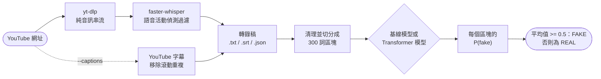

<div align="center">

🇺🇸 [English](README.md) | 🇨🇳 [简体中文](README.zh-CN.md) | 🇭🇰 **繁體中文** | 🇯🇵 [日本語](README.ja.md) | 🇰🇷 [한국어](README.ko.md)

# yt-fakenews-classifier

**把 YouTube 影片轉錄成文字，再為轉錄稿評分，衡量它讀起來有多像 REAL 或 FAKE 新聞；備有可重現的 TF-IDF 基線模型，以及可選用的多語言 Transformer 模型。**

[](https://github.com/jumincho/yt-fakenews-classifier/actions/workflows/ci.yml)
[](LICENSE)
[](pyproject.toml)
[](https://colab.research.google.com/github/jumincho/yt-fakenews-classifier/blob/main/notebooks/colab_quickstart.ipynb)

</div>

## 概覽

`ytfakenews` 是一個命令列工具，同時也是一個 Python 套件，它會：

1. 以 [yt-dlp](https://github.com/yt-dlp/yt-dlp) 下載影片的音訊，再用 [faster-whisper](https://github.com/SYSTRAN/faster-whisper) 在本地轉錄，亦可直接使用影片本身的字幕；
2. 清理轉錄稿，並把它切分成互相重疊、每個 300 詞的區塊；
3. 以標示為 REAL 或 FAKE 的新聞文章訓練而成的分類器，為每個區塊評分，再把平均 P(fake) 作為判定結果，並同時列出每個區塊的分數。

兩種分類器共用同一個介面：一種是 TF-IDF + 邏輯迴歸**基線模型**，在 CPU 上訓練約需 20 秒（測試集準確率 0.957，F1 0.958）；另一種是經過微調的 **XLM-RoBERTa** 編碼器，適合有 GPU 的用戶。

> [!IMPORTANT]
> 這個分類器學到的，是 2016 年前後的 FAKE 和 REAL *文章*是甚麼模樣：它們的文風、用詞，以及收集這些文章的網站所留下的痕跡。它不會查核事實。用於語音轉錄稿時，它的判定只是一種文風訊號，並非對真偽的判斷。使用任何結果之前，請先閱讀[模型卡](#模型卡與限制)。

## 運作原理



- **下載**：yt-dlp 的 Python API 會擷取最佳的純音訊串流。過程中不會重新編碼，所以不需要 ffmpeg。亦可以用本地的音訊或影片檔案代替網址。
- **語音轉文字**：faster-whisper 在 CTranslate2 上執行 Whisper（預設使用 `small` 模型），並配合 Silero 語音活動偵測過濾器；它以 PyAV 解碼音訊，所以既不需要 ffmpeg，也不需要 PyTorch。`--translate` 會令 Whisper 直接轉錄成英文。
- **字幕**（`--captions`）：上載者提供的字幕優先於 YouTube 的自動字幕。自動字幕因滾動顯示而產生的重複內容會被移除；經 YouTube 機器翻譯的字幕軌會在轉錄稿的 JSON 中標明。
- **清理與分塊**：時間戳記、格式標籤、`[Music]` 之類的標註，以及 `>>` 說話者標記都會被移除。之後以盡量少的 300 詞視窗覆蓋全文，相鄰視窗至少重疊 50 詞；各視窗間距平均，所以不會出現過短的尾段區塊。
- **分類**：每個區塊都會得到一個 P(fake)。轉錄稿的 P(fake) 是這些數值的平均；平均值不低於 0.5（`--threshold`）時，標籤為 FAKE。取平均值代表影片每一部分的權重相同；每個區塊的分數則顯示判定從何而來。

## 快速入門

```bash
git clone https://github.com/jumincho/yt-fakenews-classifier.git
cd yt-fakenews-classifier
python -m venv .venv && source .venv/bin/activate
pip install -e ".[asr]"

ytfakenews train baseline      # 在 CPU 上約 20 秒；寫入 models/baseline/
ytfakenews run "https://www.youtube.com/watch?v=VIDEO_ID"
```

`run` 會把轉錄稿儲存為 `outputs/<video id>.txt`、`.srt` 和 `.json`，並輸出判定結果和每個區塊的分數。首次轉錄時會從 Hugging Face Hub 下載 Whisper 模型。用 `--captions` 可略過 Whisper；用 `--language ko` 可直接指明語音所用的語言，而不作自動偵測；用 `--whisper-model large-v3` 則可取得質素更好的轉錄稿。[Colab 快速入門](notebooks/colab_quickstart.ipynb)會在瀏覽器中執行相同的步驟。

以下是把 [`examples/`](examples/) 內兩份虛構的轉錄稿當作同一篇文字讀入，再由上面訓練的基線模型評分所得的輸出：

```console
$ cat examples/transcript_local_news.txt examples/transcript_sensational.txt \
    | ytfakenews predict - --chunk-words 150 --overlap 30
FAKE  P(fake) = 0.699  (threshold 0.50, mean over 4 chunks)
model: models/baseline (baseline); input: 503 words

chunk  words        P(fake)  preview
    1  0-150          0.539  Good evening, and thanks for joining us. I'm at City Hall, where ...
    2  117-267        0.368  the public library and keeps property tax rates unchanged. City staff presented ...
    3  235-385        0.923  weekend, the farmers market returns on Saturday morning at the fairgrounds, and ...
    4  353-503        0.967  leave the house. And who gets that data? Nobody will answer that ...
```

分開評分的話，[本地新聞轉錄稿](examples/transcript_local_news.txt)被標為 REAL（P(fake) = 0.356），[聳人聽聞的那一份](examples/transcript_sensational.txt)則被標為 FAKE（0.977）。兩份都是為本儲存庫而寫，所描述的全非真實事物。

### 安裝選項

| 安裝方式 | 啟用的功能 | 主要依賴 |
| --- | --- | --- |
| `pip install -e .` | `train baseline`、`evaluate`、`predict` | numpy、pandas、scikit-learn、joblib |
| `pip install -e ".[asr]"` | `transcribe`、`run` | yt-dlp（連同 yt-dlp-ejs 和 Deno）、faster-whisper |
| `pip install -e ".[transformer]"` | Transformer 後端 | PyTorch、transformers、accelerate |
| `pip install -e ".[dev]"` | 測試及程式碼檢查工具 | pytest、ruff、mypy |

本套件並未在 PyPI 上發佈。若不是在本儲存庫的本地副本內，可直接從 GitHub 安裝，例如 `pip install "ytfakenews[asr] @ git+https://github.com/jumincho/yt-fakenews-classifier"`；這樣安裝後，訓練時須加上 `--data PATH`，因為數據集存放在儲存庫內。如某個指令需要尚未安裝的可選依賴（extra），它會提示應安裝哪一個。較新版本的 yt-dlp 需要 JavaScript 執行環境才能完整支援 YouTube，`asr` 可選依賴會透過 yt-dlp 本身的可選依賴安裝這個執行環境（Deno）。如果從 YouTube 下載開始失敗，請先更新 yt-dlp。

### Python API

```python
from ytfakenews import classify_text, load_classifier
from ytfakenews.text import read_transcript

classifier = load_classifier("models/baseline")
prediction = classify_text(read_transcript("examples/transcript_sensational.txt"), classifier)
print(prediction.label, round(prediction.p_fake, 3))  # FAKE 0.977
for chunk in prediction.chunks:
    print(chunk.start_word, chunk.end_word, round(chunk.p_fake, 3))
```

## 訓練與評估

### 數據

[`data/fake_or_real_news.zip`](data/fake_or_real_news.zip) 是公開的 fake_or_real_news 數據集（經 Kaggle 發佈）：英文新聞文章，大部分關於 2016 年大選前後的美國政治，每篇都標示為 REAL 或 FAKE。數據直接從 ZIP 檔讀取。模型只會看到文章正文，不會看到標題，因為轉錄稿沒有標題。

| 清理步驟 | 文章數目 |
| --- | ---: |
| CSV 內的行數 | 6,335（REAL 3,171，FAKE 3,164） |
| 正文為空，已刪除 | 36（全部為 FAKE） |
| 同一正文同時帶有兩種標籤，已刪除 | 0 |
| 正文重複，刪除較後出現的副本 | 241（其中 29 篇的標題、正文和標籤完全相同） |
| **保留** | **6,058（REAL 2,989，FAKE 3,069）** |
| 分層劃分，隨機種子 42 | 訓練集 4,846，驗證集 606，測試集 606 |

移除重複正文十分重要，因為有些正文會以幾個不同的標題出現；若同一正文的副本分別落在劃分的兩邊，測試分數便會被誇大。

### 基線模型結果

以單詞的一元組和二元組計算 TF-IDF（次線性 tf，`min_df` 取 3，`max_df` 取 0.9，共 209,137 個特徵），再輸入邏輯迴歸（liblinear，C = 32）。精確率、召回率和 F1 均以 FAKE 為正類。表中每一行均來自以下指令，並在儲存庫根目錄執行：

```bash
ytfakenews train baseline               # 預設隨機種子為 42；對應驗證集和測試集的行
ytfakenews evaluate --chunked           # 轉錄稿的處理流程：清理、300 詞區塊、取平均
ytfakenews evaluate --max-words 100     # 每篇文章只取前 100 詞（亦有 50、200、300）
```

| 數據劃分及輸入 | n | 準確率 | 精確率 | 召回率 | F1 | ROC-AUC |
| --- | ---: | ---: | ---: | ---: | ---: | ---: |
| 驗證集，完整文章 | 606 | 0.9505 | 0.9453 | 0.9577 | 0.9515 | 0.9900 |
| **測試集，完整文章** | 606 | **0.9571** | **0.9547** | **0.9609** | **0.9578** | **0.9895** |
| 測試集，300 詞區塊取平均 | 606 | 0.9389 | 0.9116 | 0.9739 | 0.9417 | 0.9853 |
| 測試集，前 300 詞 | 606 | 0.9323 | 0.8982 | 0.9772 | 0.9360 | 0.9830 |
| 測試集，前 200 詞 | 606 | 0.9125 | 0.8671 | 0.9772 | 0.9188 | 0.9817 |
| 測試集，前 100 詞 | 606 | 0.8498 | 0.7784 | 0.9837 | 0.8691 | 0.9759 |
| 測試集，前 50 詞 | 606 | 0.7970 | 0.7170 | 0.9902 | 0.8317 | 0.9664 |

在完整的測試集文章上，299 篇 REAL 文章中有 285 篇、307 篇 FAKE 文章中有 295 篇分類正確。較短的輸入會把 REAL 文章推向 FAKE：分塊流程把 299 篇 REAL 測試文章中的 29 篇標為 FAKE，只取前 100 詞時則為 86 篇，而 FAKE 的召回率一直維持在 0.97 以上。ROC-AUC 的跌幅遠小於準確率，顯示若為短輸入另行校準閾值，應可挽回部分損失；不過這項功能尚未實作。

C 是在驗證集上選定的：C = 4 時 F1 為 0.9353，16 時為 0.9467，32 時為 0.9515，128 時為 0.9498（`ytfakenews train baseline --C 16`，如此類推）。測試集並沒有用於任何選擇。以上數字以 Python 3.12、scikit-learn 1.9.1、NumPy 2.5.3 和 pandas 3.0.6 量度所得。CI 每次推送都會重新訓練基線模型，把測試集指標寫入工作摘要，並把 `metrics.json` 檔案作為工件上載。

### Transformer 模型

Transformer 模型尚未以完整規模進行微調，因此**這裏不提供任何 Transformer 模型的結果**。CI 會在 CPU 上以一個隨機初始化的微型模型，完整執行訓練、儲存、載入和預測的流程。如要在 GPU（例如免費的 Colab T4）上得出這些數字：

```bash
pip install -e ".[transformer]"
ytfakenews train transformer                        # xlm-roberta-base，隨機種子 42，相同的數據劃分
ytfakenews evaluate --model models/transformer --chunked
```

預設設定如下：輸入 512 個 token，並採用首尾截斷（長文章保留開首 128 個和結尾 382 個 token）；批次大小 8，梯度累積 2 步；學習率 2e-5，預熱 10%，權重衰減 0.01；最多 4 個 epoch，若連續 2 個 epoch 驗證集 F1 都沒有改善便提早停止；在 CUDA 上使用 fp16，隨機種子為 42。`models/transformer/metrics.json` 儲存驗證集和測試集的指標以及訓練記錄。`--model-name` 接受 Hugging Face Hub 上或本地目錄內的任何編碼器，包括 NLI 檢查點，例如 `symanto/xlm-roberta-base-snli-mnli-anli-xnli`，其三分類頭會換成新的 REAL/FAKE 分類頭。

為何選用多語言模型：XLM-RoBERTa 以共用詞彙表在約 100 種語言上預訓練，因此以英文文章微調的分類器，也可以套用在例如韓文的轉錄稿上（零樣本跨語言遷移）。這種遷移在本任務上是否奏效，仍未經測試。處理非英語影片的另一個方法是 `--translate`，它會令 Whisper 產生英文轉錄稿，兩種後端皆適用。

## CLI 參考

每個指令都支援 `--help`；`-v` 顯示除錯輸出，`-q` 隱藏進度訊息。結束代碼在成功時為 0，出錯時為 1（錯誤會以一行訊息輸出到 stderr），參數無效時為 2。

| 指令 | 用途 | 常用選項 |
| --- | --- | --- |
| `ytfakenews transcribe URL_OR_FILE` | 把 `<id>.txt`、`.srt` 和 `.json` 寫入 `outputs/` | `--captions`、`--language`、`--translate`、`--whisper-model`、`--device`、`--compute-type`、`--keep-audio`、`-o` |
| `ytfakenews train baseline` | 訓練、評估並儲存基線模型 | `--data`、`--seed`、`--val-size`、`--test-size`、`--C`、`--min-df`、`--max-df`、`--ngram-max`、`--output-dir` |
| `ytfakenews train transformer` | 微調、評估並儲存 Transformer 模型 | `--model-name`、`--epochs`、`--patience`、`--batch-size`、`--grad-accum`、`--lr`、`--max-length`、`--head-tokens`、`--max-train-samples`、`--fp16`/`--no-fp16`、`--cpu` |
| `ytfakenews evaluate` | 在模型訓練時所用的數據劃分上計算指標 | `--model`、`--split`、`--chunked`、`--max-words`、`--json`、`--output` |
| `ytfakenews predict FILE` | 為 `.txt`、`.srt` 或 `.vtt` 檔案、`-`（標準輸入）或 `--text` 分類 | `--model`、`--chunk-words`、`--overlap`、`--threshold`、`--device`、`--json` |
| `ytfakenews run URL_OR_FILE` | 先 `transcribe`，再 `predict` | 兩者的選項 |

`predict --json` 會輸出判定結果和各區塊的分數（此處經刪節）：

```json
{
  "model": {"path": "models/baseline", "backend": "baseline"},
  "prediction": {
    "label": "FAKE",
    "p_fake": 0.9772652175007179,
    "threshold": 0.5,
    "n_words": 238,
    "chunk_words": 300,
    "overlap": 50,
    "chunks": [{"index": 0, "start_word": 0, "end_word": 238, "p_fake": 0.9772652175007179, "preview": "Okay, everybody, listen up, ..."}],
    "n_chunks": 1,
    "aggregation": "mean"
  }
}
```

`run --json` 另外會加入 `source`、`video`（ID、標題、網址、頻道、片長、上載日期）和 `transcript`（來源、語言、詳情、片段數目和檔案路徑）。

訓練好的模型目錄內有模型檔案、`metrics.json`，以及一個 `manifest.json`，後者記錄後端、設定和數據來源（數據集路徑及 SHA-256、清理統計和數據劃分）；`evaluate` 會據此重建完全相同的數據劃分。模型經由 joblib（pickle）或 PyTorch 載入，所以只應載入你信任的模型目錄。

## 項目結構

```text
yt-fakenews-classifier/
├── src/ytfakenews/
│   ├── cli.py            命令列介面
│   ├── transcribe.py     yt-dlp 下載、faster-whisper、YouTube 字幕
│   ├── text.py           SRT/WebVTT 解析、清理、分塊
│   ├── data.py           數據集載入、清理及劃分
│   ├── baseline.py       TF-IDF + 邏輯迴歸
│   ├── transformer.py    Transformer 微調及推論（延遲匯入）
│   ├── predict.py        通用分類器介面、區塊彙總
│   ├── evaluation.py     評估指標
│   ├── artifacts.py      模型目錄清單
│   ├── errors.py         面向用戶的例外
│   └── _optional.py      可選依賴的匯入
├── tests/                離線 pytest 測試套件及測試夾具
├── data/                 fake_or_real_news.zip
├── examples/             兩份虛構的轉錄稿
├── notebooks/            colab_quickstart.ipynb
├── .github/workflows/    ci.yml
└── pyproject.toml
```

## 開發

```bash
pip install -e ".[dev]"
ruff check . && ruff format --check .
mypy        # 嚴格模式，檢查 src/ytfakenews
pytest      # 離線執行；需要某個可選依賴的測試，在未安裝該依賴時會略過
```

完整測試套件另外包括 Transformer 冒煙測試（一個隨機初始化的微型 BERT，配上即場建立的分詞器），並以本地 HTTP 伺服器測試真正的 yt-dlp 和 faster-whisper：

```bash
pip install torch --index-url https://download.pytorch.org/whl/cpu
pip install -e ".[asr,transformer,dev]"
YTFAKENEWS_REQUIRE_EXTRAS=1 HF_HUB_OFFLINE=1 pytest
```

[CI](.github/workflows/ci.yml) 會在 Python 3.10、3.12 和 3.13 上執行程式碼檢查工具、類型檢查器和測試，以隨附的數據重新訓練基線模型，測試 `pyproject.toml` 所容許的最舊依賴版本，並以只用 CPU 的 PyTorch 執行完整測試套件。

## 模型卡與限制

- **預期用途**：教學及實驗，例如研究在某一領域訓練的分類器在另一領域的表現。它不適用於內容審核、事實查核，亦不適用於就個人或頻道作出決定。
- **訓練數據**：約六千篇英文文章，大部分關於 2016 年大選前後的美國政治，每篇文章整體標示為 REAL 或 FAKE。其他時期、題材和國家的內容均屬分佈以外。
- **基線模型學到了甚麼**：它最強的 FAKE 特徵包括「2016」、「october」、「november 2016」、「share」、「print」、「via」和「source」；最強的 REAL 特徵包括「said」、「percent」、「tuesday」、「gop」和「sen」（訓練後，完整清單見 `models/baseline/metrics.json`）。這些是日期、所收集網頁的殘留內容和通訊社式的措辭：它們透露的是文本在何處、何時發表，而不是內容是否屬實。高測試分數主要顯示的，是這類線索能把兩組網站區分得多好。
- **由文章到語音**：轉錄稿沒有標題或署名，用語口語化，而且含有識別錯誤，標點亦很少。分數並未針對轉錄稿校準。即使在文章上，分塊和短輸入已會令預測偏向 FAKE（見結果表），所以較短的影片更可能被標為 FAKE。
- **語言**：訓練數據是英文。`--translate` 和多語言 Transformer 模型是處理其他語言的兩種方法，但兩者都未曾就本任務作過評估。
- **轉錄稿**：Whisper 和 YouTube 的自動字幕都會出現識別錯誤；而語言與影片中所講語言不同的自動字幕，都是機器翻譯的結果。
- **標籤並非定論**：FAKE 的意思是「與訓練集中的 FAKE 文章相似」。切勿把它當作影片內容失實的論斷來發佈，亦不要據此採取行動。

## 授權條款

程式碼以 [MIT 授權條款](LICENSE)發佈，版權所有 (c) 2023 jumincho。隨附的數據集按其在 Kaggle 上發佈時的原樣再分發，並不在該授權條款的涵蓋範圍內。
